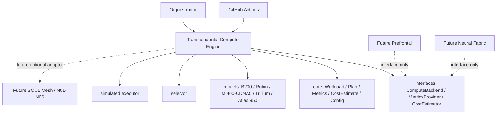

# Transcendental Compute Engine — Forensic Audit

## Snapshot

Repository: `divibisoul/Orquestrador-`
Branch audited: `main`
Package: `compute/transcendental`

The initial repository was almost empty. The current tree now contains the isolated TCE package, configuration, Go module and dedicated CI. The package remains isolated from the rest of the repository because `runtime.go`, `router.go` and `cortex.go` do not exist in the audited tree.

## Architecture graph



## Area-by-area status

| Area | State | Finding | Required action |
|---|---|---|---|
| Repository foundation | GREEN | Minimal non-destructive base | Keep root clean; add only required runtime/config layers |
| Go module | GREEN | `go.mod` exists, Go 1.22 | Keep module dependency-free until real integration requires otherwise |
| Core structs | GREEN | Required types and validation exist | Preserve stable contracts |
| Interfaces | GREEN | Three requested interfaces exist | Use interfaces at Prefrontal/Neural Fabric boundary |
| Performance models | YELLOW | Five models exist; Rubin/Atlas are reference estimates | Keep explicit caveats and refresh data when official specs exist |
| Roofline math | GREEN/YELLOW | Deterministic formula exists | Add operation-specific models only if supported by real evidence |
| Selector | GREEN | Mode, strategy, memory and precision logic present | Expand tests for every mode/strategy combination |
| Executor | GREEN/YELLOW | Bounded worker pool; no sleep | Propagate per-item errors from `ExecutePlan` rather than discarding them |
| Metrics | YELLOW | History exists; timestamp is observational | Keep deterministic model math; distinguish observational metadata from simulation result |
| Configuration | GREEN/YELLOW | Disabled by default; effective worker cap | Integrate only through nil-safe optional dependency later |
| Tests | YELLOW | Unit and integration suites exist | Expand edge-case coverage and race-sensitive tests |
| CI | YELLOW | Real GitHub Actions workflow runs build/test/vet/race/vuln checks | Current run must be allowed to reach compile/test stages after selector fix |
| External integration | NOT STARTED | No runtime/router/cortex files exist | Do not invent integration points; wait for real files, then inspect and patch minimally |
| SOUL connection | PREPARED | Contracts are provider-neutral | Add a thin adapter only after the orchestration contract is established |

## Critical defect found and corrected

GitHub Actions exposed a compile failure in `selection/selector.go`: a `float64` was treated as `time.Duration` by calling `.Seconds()` after converting the duration to float64. The selector was corrected to preserve the duration until `.Seconds()` is called.

The same correction also hardened selection by using `Workload.Validate()`, skipping zero-PFLOPS candidates, preserving explicit model modes, and implementing `precision_first` scoring.

Commit: `3ab98539df87ed0bb0878e190ea0f135423ee679`.

## Readiness graph toward the missing piece

```text
Current
  │
  ├── isolated TCE ..................... READY
  ├── interfaces ....................... READY
  ├── models ........................... READY*
  ├── selector ......................... READY*
  ├── executor ......................... READY*
  ├── tests ............................ NEEDS EXPANSION
  ├── CI ............................... RUNNING/REVALIDATING
  │
  └── optional Orquestrador integration NOT YET AVAILABLE
                                         │
                                         ▼
                          real Prefrontal / Neural Fabric code
                                         │
                                         ▼
                           minimal interface injection
                                         │
                                         ▼
                               SOUL Mesh adapter
                                         │
                                         ▼
                                N01–N06 routing

* ready at code level, not proof of production/runtime accuracy.
```

## Optimization backlog before integration

1. Preserve strict package isolation.
2. Complete selector edge-case matrix: each explicit mode, each strategy, unsupported precision, memory rejection and fallback.
3. Make `ExecutePlan` return per-workload errors instead of discarding them.
4. Add deterministic metric assertions that ignore observational timestamps.
5. Add model metadata exposing whether figures are official, preliminary or relative-scale estimates.
6. Add an integration-neutral adapter layer only after actual Prefrontal/Neural Fabric files are present.
7. Add a SOUL-facing capability descriptor without importing any nucleus repository.
8. Keep `compute.enabled=false` as the default integration posture.

## Non-negotiable integration gate

No external file should be modified merely to make the TCE visible. The next integration phase begins only after the real target files are read from GitHub and the minimal diff is established.

## Verification status

The package has been statically inspected through the current GitHub tree, and the GitHub Actions workflow has executed against the repository. Runtime/E2E verification is not claimed until the workflow reaches and passes all compile/test/build stages.
